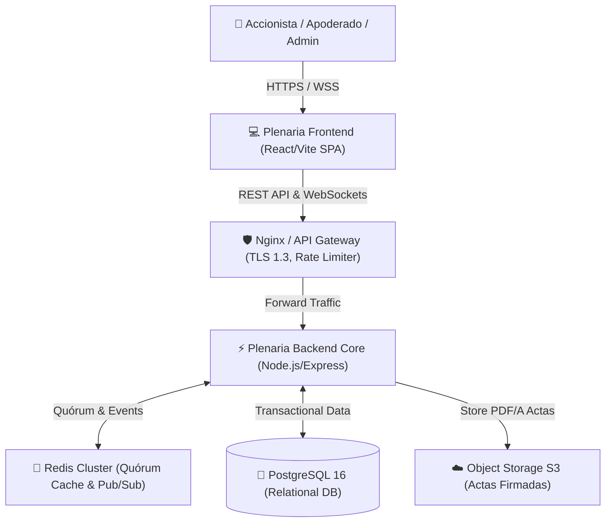

# 🏗️ Plenaria Architecture & System Design Specs

## System Context Diagram (C4 Level 1)



## Component Architecture (Backend Core - Senior Level)

```
backend/
├── src/
│   ├── config/          # Variables de entorno y configuración de DB/Redis
│   ├── controllers/     # Manejadores de solicitudes HTTP (REST Handlers)
│   ├── middleware/      # JWT, RBAC, Rate Limiting, Error Handling
│   ├── models/          # Abstracción de modelos y consultas SQL
│   ├── routes/          # Enrutamiento modular Express (/auth, /assemblies, /votes)
│   ├── services/        # Lógica de negocio (Quorum Engine, Voting Processor, SHA-256)
│   ├── websocket/       # Servidor Socket.io para métricas en vivo
│   ├── app.js           # Aplicación Express configurada
│   └── server.js        # Entry point del servidor HTTP & WebSocket
```
